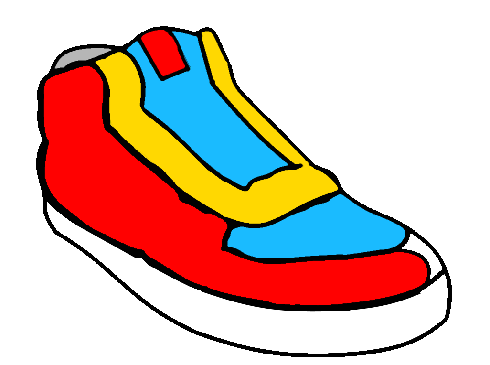

<p align="center">

</p>

# SneakerJS User Guide

Feel free to raise pull requests if you find anything is wrong or missing.

# Installation

```shell
npm install sneakerjs --save
```


# Getting Started

These steps show you how to get up and running with PouchDB (which can also connect to CouchDB). See [Other Backends](#Other Backends) for how to make it work with other providers.

##### 1 Include the sources

```html
    <script src="node_modules/angular/angular.min.js"></script>
    <script src="node_modules/pouchdb/dist/pouchdb.min.js"></script>
    <script src="node_modules/sneakerjs/dist/sneakerjs.min.js"></script>
```

##### 2 Import SneakerJS into your Angular app

```javascript
angular.module('app', ['SneakerJS']);
```

##### 3 Create a SneakerModel instance

The **SneakerModel** object is what you define your collections on. It is also the object on which the generated functions will be attached. I like calling mine **db**:

```javascript
app.run(function(SneakerModel){
  var backend = new PouchDB('my_demo_app')
  var db = new SneakerModel(backend)
  db.collection('customer', ['name'])
  ...
});
```

You can attach it to $rootScope to make it directly available in your templates:

```javascript
$rootScope.db = db;
```
    
A neat trick to make the model available as a service is using JavaScript's **call** on **SneakerModel** passing **this** (which will be your newly instantiated service):

```javascript
app.service('db', function(SneakerModel) {
  var backend = new PouchDB('my_demo_app')
  SneakerModel.call(this, backend);
});
```
You can now inject it into other providers in your app:

```javascript
app.controller('Ctrl', function(db) {
  var customersWithNoOrders = db.findCustomers(function(customer) {
    return db.getCustomerOrders(customer).length == 0;
  });
  ...
});
``` 

##### 4 Define your initial loading function (optional)

By default, SneakerJS will use **allDocs** as the initial loading function (as it is usually a PouchDB object):

```javascript
backend.allDocs({
  include_docs: true,
  attachments: false
});
```
    
However you can specify the query to exectute when initializing the SneakerModel:

```javascript
app.service('db', function(SneakerModel) {
  var backend = new PouchDB('my_demo_app');
  var loadFunction = function() {
    //return a json object similar to allDocs
  };
  SneakerModel.call(this, backend, loadFunction);
});
```

The initial loading function gets called once on **dataReady** (see below).

##### 5 Define your model

Define all your collections, singletons and relationships before calling  **db.dataReady()**.

It is best to do this right after instantiating your SneakerModel, in a section of code that will run early, such as your app's **run** function or in a service.

##### 6 Wait for dataReady

The first call to **db.dataReady()** will call the initial loading function and return a promise, which will resolve once the data is loaded.

Subsequent calls will simply return the same promise. This means you can use it inside controllers to wait for the initial data load to complete:

```javascript
app.controller('Ctrl', function(db) {
  $scope.ready = false; // use this to hide UI elements...
  db.dataReady().then(function(){
    $scope.customers = db.allCustomers(); 
    $scope.ready = true;
  });
  ...
});
```

##### 7 Peek at the generated functions

Use **db.printInfo()** to print out a list of all the generated functions to the console:

```javascript
db.getCustomer()
db.newCustomer()
...
```

##### 8 Start playing!

Once **db.dataReady()** has resolved, you can use the generated functions inside your providers, or directly inside the template if you made **db** available in the scope/rootScope. 

Here's a page to create/delete customers and their orders for our shopping app based on the definitions at the top of this readme.

```html
<input ng-model="newCustomerName">
<button ng-click="db.newCustomer({name: newCustomerName})">Add</button>
<div ng-repeat="customer in db.allCustomers()">
  {{customer.name}}
  <button ng-click="db.deleteItem(customer)">Remove</button>
  <div ng-repeat="order in db.getCustomerOrders(customer)">
    {{order.value}}
    <button ng-click="db.deleteItem(order)">Remove</button>
  </div>
  <input ng-model="newOrderValue">
  <button ng-click="db.newOrder({value: newOrderValue, customer: customer})">Add</button>
</div>
```

This saves changes to direct to the database, no extra code needed!

SneakerJS's changes are wrapped in **$q** promises, meaning they will trigger Angular's digest cycle, so there is no need to use an additional layer such as [angular-pouchdb](https://github.com/angular-pouchdb/angular-pouchdb).


# API (functions on SneakerModel)

SneakerModel is the only object you interact with. It starts off with the following functions:

  - **collection** - Defines a collection.
  - **oneToMany** - Defines a one to many relationship between two collections.
  - **manyToMany** - Defines a many to many relationship between two collections.
  - **singleton** - Defines a singleton in the database.
  - **dataReady** - Returns a promise once the data is loaded.
  - **deleteItem** - Generic function for deleting any collection item.
  - **saveItem** - Generic function for saving changes to any collection item.
  - **printInfo** - Prints a list of the generated functions.
  - **reload** - Clears all the collections and rebuilds them from the initial load query.

Defining collections, singletons and relationships adds functions to the SneakerModel instance. 

These are referred to as the *generated functions*, and are documented below.

### db.collection(name, fields, options)

Defines a collection, i.e. a series of objects of the same type.

#####Parameters

| Name          | Type      | Required  | Comments |
| ------------- | --------- | --------- | ----------------|
| name          | string    | yes       | Must be unique. Use singular (e.g. cat, not cats)
| fields        | [strings] | yes       | Must be unique within array. Don't start with underscores.
| options       | object    | no        | See below

##### Options

| Name          | Type      | Comments |
| ------------- | --------- | ----------------|
| plural        | string    | The string to use for plural form.|
| proto         | function  | Causes all items in this collection to be instantiated with **new** MyFunction().|

##### About 'plural'

This is just cosmetic, and only affects the naming of generated functions where the plural would otherwise just be generated by adding **s**, including relationships.

```javascript
db.collection('country')
db.collection('person', {plural: 'people'})
db.oneToMany('country', 'person')
...
db.getPerson()
db.findPeople()
db.getCountryPeople()
``` 

##### About 'proto'

This is a powerfull feature, essentially turning SneakerJS into an ORM.

```javascript
var Customer = function() {};
//fields will be added after call to "new Customer()"
Customer.prototype.getOrderValue = function() {
  var total = 0;
  db.getCustomerOrders(this).forEach(function(order){
    db.getOrderItems(order).forEach(item) {
      total += item.price;
    }
  });
  return total;
};
db.collection('customer', {proto: Customer});
...
c1 = db.getCustomer('id_0001');
c1.getOrderValue();
```    


### db.oneToMany(childCollectionName, parentCollectionName, options)

Defines a one to many relationship between two collections.

#####Parameters

| Name          | Type      | Required  | Comments |
| ------------- | --------- | --------- | ----------------|
| childCollectionName   | string    | yes       | Must match the name of a collection  defined previously
| parentCollectionName   | string    | yes       | Must match the name of a collection defined previously
| options       | object    | no        | See below

##### Options

| Name          | Type      | Comments |
| ------------- | --------- | ----------------|
| childAlias    | string    | The name used for the child side of the join.
| parentAlias   | string    | The name used for the parent side of the join.
| cascadeDelete | boolean   | Whether to delete linked child objects when parent is deleted. Defaults to true.

##### About aliases

Aliases can be used to define multiple relationships of the same type between the same two collections without clashes.

```javascript
db.collection('company')
db.collection('person', {plural: 'people'})
db.oneToMany('company', 'person', {parentAlias: 'employer', childAlias: 'employee')
db.oneToMany('company', 'person', {parentAlias: 'favouriteCompany')
```

Aliases affect the generated function names:

```javascript
db.getPersonEmployer()
db.getCompanyEmployees()
db.getPersonFavouriteCompany()
db.getCompanyPeople() // careful, this only returns people linked on the second relationship.
```    

The parentAlias affect how the relationship is stored in the database, so changing it on an existing dataset will break the links.

The parentAlias can also be used when creating child objects:

```javascript
employerA = db.getEmployer('id_001');
db.newPerson({name: 'Bill', employer: employerA});
//This creates a linked between the new person and employerA
```

SneakerJS attempts to prevent ambiguous clashes, but does not currently check for everything.
    

### db.oneToMany(leftCollectionName, rightCollectionName, options)

Defines a many to many relationship between two collections.

#####Parameters

| Name          | Type      | Required  | Comments |
| ------------- | --------- | --------- | ----------------|
| leftCollectionName   | string    | yes       | Must match the name of a collection  defined previously
| rightCollectionName  | string    | yes       | Must match the name of a collection defined previously
| options       | object    | no        | See below

##### Options

| Name          | Type      | Comments |
| ------------- | --------- | ----------------|
| qualifier    | string     | Used to allow multiple many to many joins
| dbDocumentType   | string  | The name used for the parent side of the join


##### About qualifiers

A qualifier can be used to define multiple relationships of the same type between the same two collections without clashes.

```javascript
db.collection('person', ['name'])
db.collection('cat', ['name'])
db.manyToMany('person', 'cat', {
  qualifier: 'owner'
});
db.manyToMany('person', 'cat', {
  qualifier: 'friend'
});
...
// Generates these functions:
db.getPersonCatsAsOwner
db.getCatPeopleAsOwner
db.addPersonCatAsOwner
db.removePersonCatAsOwner
db.isPersonLinkedToCatAsOwner
db.getPersonCatsAsFriend
db.getCatPeopleAsFriend
db.addPersonCatAsFriend
db.removePersonCatAsFriend
db.isPersonLinkedToCatAsFriend
``` 

Remember, this JavaScript, so ou can always map a generated function to another name:

```javascript
db.linkCatFriend = db.addPersonCatAsFriend
//linkCatFriend now points to the function addPersonCatAsFriend
```

# Generated functions
    
## Collection functions

Given a collection:

```javascript
db.collection('cat', ['name', 'color'])
```

SneakerJS will generate the following functions:

#### db.newCat(data)

Where 'data' is an object with the fields as in the collection definition.

```javascript
db.newCat({
  name: 'Mog', 
  color: 'Tabby',
  age: 22 // This field will not be saved, as it is not in the collection definition.
})
```

Note that fields are not mandatory (Future versions of SneakerJS may implement advanced fields)

This function returns a promise, which resolves to the newly created object:

```javascript
db.newCat(data).then(function(cat) {
  //cat is the newly created cat object
  console.log(cat._id)    // field generated by pouchdb/couchdb
  console.log(cat._rev)   / field generated by pouchdb/couchdb
  console.log(cat.name)
  console.log(cat.color)
})
```

You can also link items in a oneToMany relationship at point of creation:

```javascript
db.collection('person', ['name'])
db.collection('cat', ['name', 'color'])
db.oneToMany('person', 'cat')
...
var person1 = db.getPerson('0001')
db.newCat({
  name: 'Mog', 
  color: 'Tabby',
  person: person1  //The new cat will be joined to person1
}).then(function(cat) {
  console.log(cat.name)
  console.log(cat.person)            // this doesn't work!
  console.log(db.getCatPerson(cat))  // use this instead... 
})
// person1 now owns the cat:
db.getPersonCats(person1) // [cat1, ]
```

Note that if a parentAlias was supplied, you must use that alias instead:

```javascript
db.collection('person', ['name'])
db.collection('cat', ['name', 'color'])
db.oneToMany('person', 'cat', {parentAlias: 'owner')
...
var person1 = db.getPerson('0001')
db.newCat({
  name: 'Mog', 
  color: 'Tabby',
  owner: person1    // Note owner, not person
}).then(function(cat) {
  console.log(db.getCatOwner(cat))
})
```

#### db.getCat(id)

Gets an object in a collection given its _id.

```javascript
// This is not a promise, it returns immediately
db.getCat('6TSH8A79D97A') 
// returns {name: 'Mog', color: 'Tabby'}
```

#### db.findCats(query)

Finds object in a collection.

```javascript
// This is not a promise, it returns immediately
db.findCats({color: 'Tabby'}) 
// returns [{name: 'Mog', color: 'Tabby'}, ...]
```

You can pass an object as above, or a predicate function:

```javascript
var catsWithNoFriends = db.findCats(function(cat) {
  return db.getCatFriends(cat).length == 0;
})
```
A new array is returned each time.

```javascript
var a = db.findCats({color: 'Tabby'}) 
var b = db.findCats({color: 'Tabby'}) 
a === b  // false
```

#### db.allCats()

Returns the array containing all objects in the collection. This is the same array object every time, so you can watch it for changes.

```javascript
var a = db.allCats()
//add or remove cats
var b = db.allCats()
a === b  // true
```

Do not mess with this array by adding or removing elements. Use **newCat()** and **deleteItem()** functions to manipulate the collection. The array which was returned by **db.allCats()** will be updated, and this is all wrapped in **$q** promises so it will trigger the digest loop.

## oneToMany functions

Given this model:

```javascript
db.collection('person', ['name'])
db.collection('dog', ['name', 'breed'])
```

SneakerJS will generate the following functions:

#### db.getDogOwner(dog)

Returns the child object's parent. This is not a promise, it returns immediately. 

#### db.getPersonDogs(person)

Returns an array of the parent objects's children. This is not a promise, it returns immediately. 

This is the same array object every time, so you can watch it for changes.
 
```javascript
var a = db.getPersonDogs(person1)
//add or remove dogs
var b = db.getPersonDogs(person1)
a === b  // true
```

#### db.setDogOwner(dog, owner)

Sets the child object's parent. Parent can be null.

This function is a promise, but it is wrapped in $q so you can often just call it as is:

```javascript
db.setDogOwner(dog, owner)
```

Angular will update the view once the promise resolves, without you having to do anything.

## manyToMany functions

Given this model:

```javascript
db.collection('person', ['name'])
db.collection('cat', ['name'])
db.manyToMany('person', 'cat')
```

SneakerJS will generate the following functions:

#### db.getPersonCats(person)

Returns an array of the left side objects's right side counterparts. This is not a promise, it returns immediately. 

This is the same array object every time, so you can watch it for changes.

#### db.getCatPersons(cat)

Returns an array of the left side objects's right side counterparts. This is not a promise, it returns immediately. 

This is the same array object every time, so you can watch it for changes.

Note, to get **db.getCatPeople()** you simply need to set the plural on the collection:
```javascript
db.collection('person', ['name'], {plural: 'people')
db.collection('cat', ['name'])
db.manyToMany('person', 'cat')
...
db.getCatPeople()
```

#### db.addPersonCat(person, cat)

Adds a link between the left and right side objects.

This function is a promise, but it is wrapped in $q so you can often just call it as is and angular will update the UI once the promise is resolved.

#### db.removePersonCat(person, cat)

Removes the link between the left and right side objects.

This function is a promise, but it is wrapped in $q so you can often just call it as is and angular will update the UI once the promise is resolved.

## manyToMany functions with qualifier

Given this model:

```javascript
db.collection('person', ['name'], {plural: 'people')
db.collection('cat', ['name'])
db.manyToMany('person', 'cat', {
  qualifier: 'owner'
});
db.manyToMany('person', 'cat', {
  qualifier: 'friend'
});
```

SneakerJS will generate the same functions as above, but with "AsXYZ" appended to the function name:

```javascript
db.getCatPeopleAsOwner
db.addPersonCatAsOwner
db.removePersonCatAsOwner
db.isPersonLinkedToCatAsOwner
db.getPersonCatsAsFriend
db.getCatPeopleAsFriend
db.addPersonCatAsFriend
db.removePersonCatAsFriend
db.isPersonLinkedToCatAsFriend
```

Which behave the same as above.

# Other Backends

SneakerJS only calls a small number of functions on the PouchDB object:

  - allDocs (unless you provide a different load query)
  - post
  - put
  - get
  - remove

Instead of passing a PouchDB instance to SneakerModel, you can pass your own object which implements these methods using the same signatures as PouchDB, but which ferries the data to whatever API you like.

There is no documentation yet on what data is passed to those methods, so you will need to do a bit of introspection. 

Something like this should get you started:


```javascript
var DbSpy = function(databaseName) {
  var pouch = new PouchDB(databaseName);
  this.put = function(data) {
    console.log(data);
    return pouch.put(data).then(function(rtnData) {
      console.log(rtnData);
      return rtnData;
    });
  }
  //repeat for post, remove, get etc...
}
...
SneakerModel(new DbSpy('demo_db'));
```